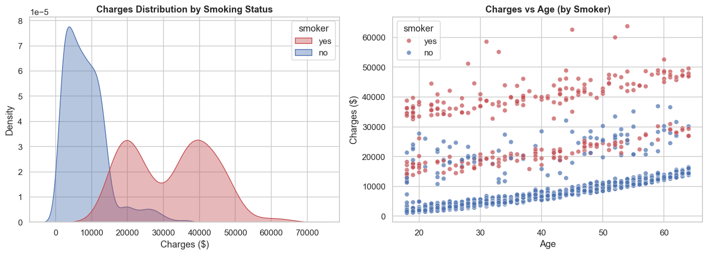
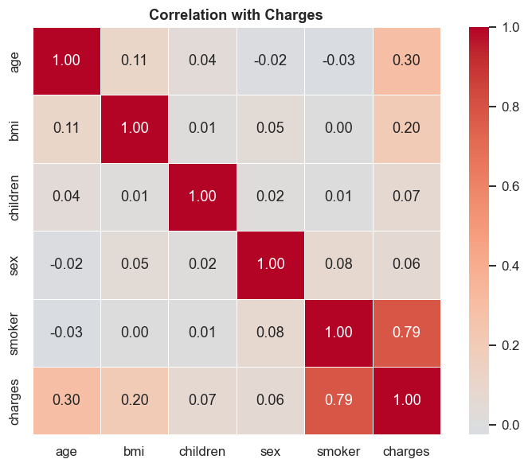
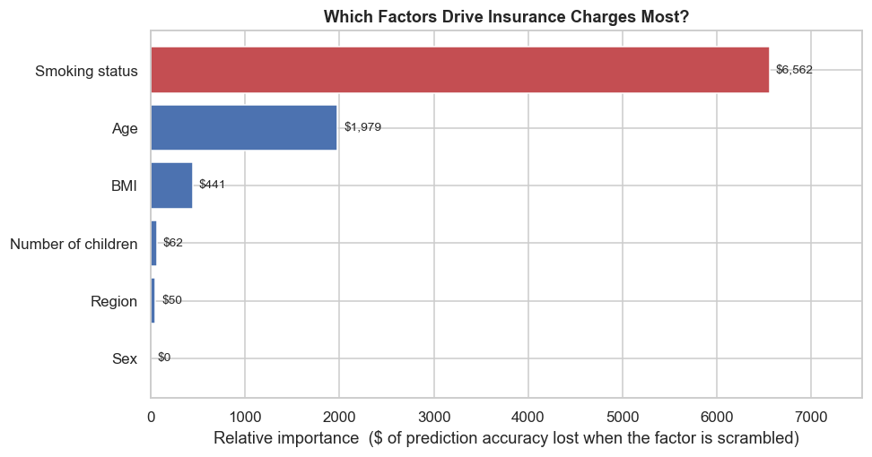

# Predicting Medical Insurance Charges

**Author:** Adil Sameer

## Executive summary

Medical insurance pricing often feels like a black box to the people paying for it. This project uses the **Medical Cost Personal Dataset** (1,338 individuals) to quantify — in plain dollar terms — how demographic and lifestyle factors drive an individual's medical insurance charges.

Through exploratory data analysis and a baseline regression model, the analysis shows that **smoking is by far the single largest cost driver**: smokers are billed on average **~$32,050** versus **~$8,441** for non-smokers — about **$23,600 more per person**, nearly **4× higher**. Age and BMI are the next most important factors, and BMI's effect is dramatically amplified for smokers. A baseline **Linear Regression** model predicts charges with a **Mean Absolute Error (MAE) of ≈ $2,830** and explains about **89% of the variance (R² ≈ 0.89)**, providing a strong, interpretable benchmark for the final capstone.

## Rationale

Why should anyone care about this question? Insurance costs are among the largest recurring expenses households face, yet the logic behind pricing is opaque to the people paying. Making the cost drivers transparent has real value:

- **For individuals**, it turns abstract health advice into concrete financial stakes — seeing that smoking could add tens of thousands of dollars in billed costs is far more motivating than a generic warning.
- **For insurers and employers** designing wellness programs, it identifies which factors yield the biggest savings so resources go toward interventions that actually move the needle (e.g., smoking-cessation support).
- **For policymakers and the public**, it grounds debates about fair pricing in evidence rather than assumption.

## Research Question

**To what extent can demographic and lifestyle factors — specifically age, BMI, smoking status, sex, number of dependents, and region — predict an individual's medical insurance charges?**

## Data Sources

The [Medical Cost Personal Dataset on Kaggle](https://www.kaggle.com/datasets/mirichoi0218/insurance) (a copy is included at `data/insurance.csv`). It contains 1,338 records with seven columns:

| Column | Type | Description |
|---|---|---|
| `age` | integer | Age of the primary beneficiary |
| `sex` | categorical | `female` / `male` |
| `bmi` | float | Body mass index (kg/m²) |
| `children` | integer | Number of dependents covered |
| `smoker` | categorical | `yes` / `no` |
| `region` | categorical | US region (NE, NW, SE, SW) |
| `charges` | float | **Target** — individual medical costs billed by insurance |

The data is clean, tabular, and structured with a mix of numerical and categorical features and no missing values, making it well suited for a supervised **regression** problem — that is, we learn from examples where the answer (`charges`) is already known, and we predict a **number** (a dollar amount) rather than a category.

## Methodology

The analysis in the [Jupyter notebook](./capstone_insurance_eda.ipynb) is structured around the **CRISP-DM** framework (Business Understanding → Data Understanding → Data Preparation → Modeling → Evaluation → Deployment), with each section tagged by its phase:

1. **Data Cleaning** — checked for missing values (none found), removed 1 exact duplicate row, validated categorical domains and data types.
2. **Outlier Analysis** — used histograms with IQR outlier fences on `age`, `bmi`, and `charges`. High-`charges` "outliers" were confirmed to be legitimate high-cost patients (mostly smokers / high BMI) and were retained; the right-skew was noted, and a log-transformed target was prepared for later modeling.
3. **Exploratory Data Analysis** — univariate distributions and bivariate analysis (histograms, density curves, scatter plots, count plots, correlation heatmap) for both categorical and continuous variables.
4. **Feature Engineering** (reshaping raw columns so the model can use them, and adding new ones that capture patterns from the EDA) — turned words into numbers (0/1 for `sex`/`smoker`; a separate 0/1 column per `region`, i.e. *one-hot encoding*), grouped BMI and age into readable bands, and added a **`smoker × BMI` interaction** column (smoking status multiplied by BMI) to capture that BMI raises costs far more for smokers.
5. **Baseline Modeling** — an assembly-line `Pipeline` that first puts the numbers on a common scale and converts categories to numbers, then fits a `LinearRegression`, trained on 80% of the data and tested on the held-out 20%, judged mainly by **MAE**.

### Why MAE?
Mean Absolute Error is reported in the **same units as the target (dollars)**, so it is directly interpretable for a non-technical audience ("on average the prediction is off by $X"). Unlike RMSE, it does not over-penalize the naturally large errors on the high-cost smoker tail, giving an honest picture of typical accuracy. RMSE and R² are reported as supporting context.

## Results

**Key EDA findings:**

1. **Smoking is the dominant cost driver.** Average charges: **smokers ≈ $32,050** vs **non-smokers ≈ $8,441** — roughly **$23,600 more per person** (~3.8× higher), with almost no overlap between the groups.
2. **Age** raises charges steadily and roughly linearly.
3. **BMI** matters mainly *for smokers* — charges climb sharply once BMI crosses ~30 (obesity threshold), a clear interaction effect.
4. **Sex, number of children, and region** have only minor effects.

Correlation with `charges`: `smoker` (0.79) ≫ `age` (0.30) > `bmi` (0.20) > `children` (0.07) > `sex` (0.06).

**Baseline model performance (test set):**

| Metric | Value |
|---|---|
| **MAE** (primary) | **$2,828.97** |
| RMSE | $4,572.81 |
| R² | 0.886 |

**How to read these two numbers** (they answer different questions):

- **MAE ≈ $2,830** is the average dollar gap between the predicted and actual bill for a typical person — e.g., predicting $10,200 for someone who paid $9,000 is a $1,200 miss, and averaging every such miss across the held-out test set gives ~$2,830.
- **R² ≈ 0.89** means the model explains about 89% of the person-to-person variation in charges (the rest is noise and factors not in the data).

These agree rather than conflict: charges span roughly $1,100–$64,000 (averaging ~$13,000), so a ~$2.8k typical miss is small relative to that spread — which is exactly what produces the high R².

**Which factors matter most?** The chart below ranks each factor by how much the model relies on it (measured as the drop in prediction accuracy when that factor is scrambled). This directly answers the research question:

The order — **smoking ≫ age > BMI > number of children > region > sex** — matches the hypothesis exactly. Smoking status is in a league of its own, dwarfing every other factor, while sex has essentially no effect on the predicted bill.

## Next steps

This baseline gives us a clear number to beat. Next, I'll try a few other well-known prediction methods and see which one estimates charges most accurately:

- **Simpler, self-tuning linear models** (for example, Ridge and Lasso regression) that automatically downplay the factors that don't add much, so the model stays lean and reliable.
- **Curved (non-straight-line) relationships** (for example, polynomial regression), to capture effects that speed up or slow down — like how costs accelerate at higher BMI for smokers.
- **"Grouping" and "look-alike" models** (for example, a decision tree or k-nearest-neighbors) that predict a person's cost by splitting the data into similar groups or by comparing each person to others who look like them.

I'll also re-test each model on several different splits of the data to make sure the results hold up, try predicting charges on a "smoothed" scale (for example, a log transformation) that tames the extreme values, and finish with the single best model plus a plain-English explanation of what drives costs — and by how many dollars — for the final capstone report.

## Outline of project

- [Capstone notebook — Initial Report & EDA](./capstone_insurance_eda.ipynb)

## Contact and Further Information

Adil Sameer — UC Berkeley / Professional Certificate in Machine Learning & Artificial Intelligence Capstone.
